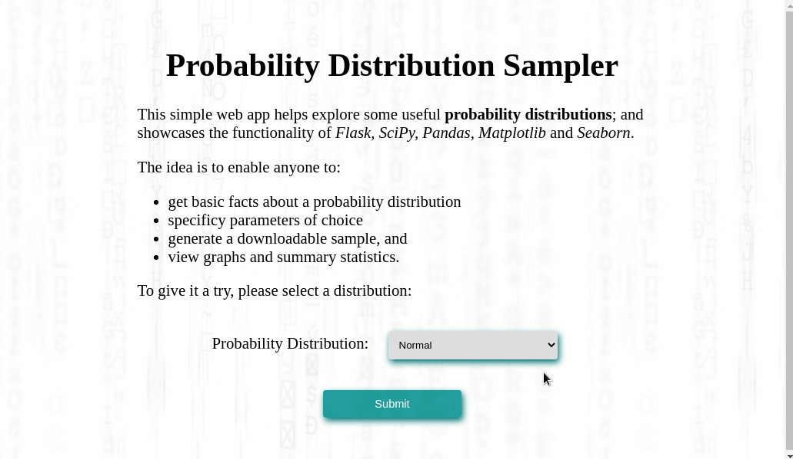

# Probability Distributions with Flask

A simple web app that introduces several popular and useful probability distributions.

Powered by:

- [Flask][flask] - web application interface
- [Pandas][pandas] - data manipulation
- [SciPy][scipy] - generating samples
- [Seaborn][seaborn] - plotting visualisations



A similar, [interactive version][stats-app] of this app based on [Dash][dash] is also available.

## Getting Started

- Download the files, create a virtual environment, and activate it:

    ```bash
    git clone https://github.com/Tim-Abwao/probability-distributions-with-flask.git
    cd probability-distributions-with-flask
    python3 -m venv venv
    source venv/bin/activate
    ```

- Install the required packages:

    ```bash
    pip install -U pip
    pip install -r requirements.txt
    ```

- Start the [flask development server][dev-server]:

    ```bash
    export FLASK_APP=stats_app
    export FLASK_ENV=development
    flask run
    ```

    Afterwards, browse to <http://localhost:5000>.

[flask]: https://flask.palletsprojects.com/
[pandas]: https://pandas.pydata.org
[scipy]: https://www.scipy.org
[seaborn]: https://seaborn.pydata.org
[dash]: https://plotly.com/dash/
[stats-app]: https://probability-distributions.herokuapp.com
[dev-server]: https://flask.palletsprojects.com/server/
